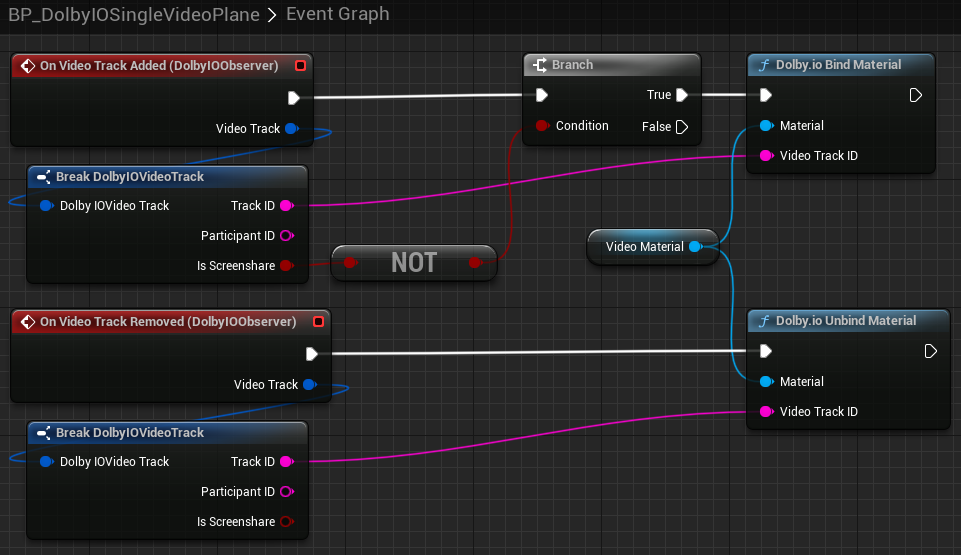

## Setup

This tutorial showcases how to render camera video coming from other participants.

Please follow the [common setup](common-setup) steps first.

## Remote video

Find `BP_DolbyIOSingleVideoPlane` in the plugin's content in `Content Browser` and drag it onto the scene. Preferably put it in front of the player start position, rescale it to the desired aspect ratio (here: [6.4, 3.6, 1.0]) and rotate it by [90, 0, 90] to make it face the player start. You should end up with something like this (except `BP_DolbyIOSingleVideoPlane` instead of `BP_DolbyIOVideoPreviewPlane`):

> **_NOTE:_** If you do not see this item, go to the `Content Browser` settings and tick `Show Plugin Content`.

If you launch the game now, assuming you successfully connect to a conference with at least one remote participant video enabled, you should see one video feed on the plane.

> **_NOTE:_** This particular implementation allows only one remote video feed at a time. Under normal conditions, users will likely create multiple planes, assign them to specific participants and heavily modify this sample.

## How it works

`BP_DolbyIOSingleVideoPlane` is a sample Blueprint with a simple `Event Graph`, which handles [`On Video Track Added`](../blueprints/Events/on-video-track-added) and [`On Video Track Removed`](../blueprints/Events/on-video-track-removed).

It also contains a generic `Construction Script` to set up the plane's material:

> **_NOTE:_** As a useful practical exercise, you can also make the plane invisible by default, then make it visible when screenshare is started and invisible again when it is stopped.
